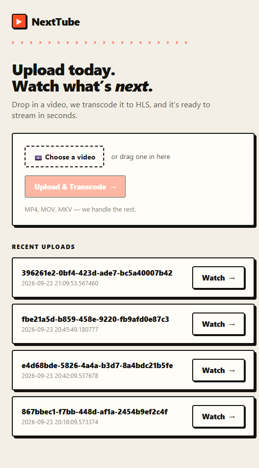

# NextTube

Upload a video, it gets transcoded to HLS through Kafka and FFmpeg, and you watch it back in the browser.



## How the pipeline works

**Upload.** The browser posts the file straight to FastAPI, which streams it into MinIO and inserts a `videos` row in Postgres. Nothing else happens yet — no job, no Kafka.

**Queueing the job, safely.** `POST /jobs/transcode` writes a `jobs` row and an outbox row in the *same* Postgres transaction. This is the part that actually matters from a system-design angle: if the API process dies right after the transaction commits, the fact that "this video needs transcoding" is already durable in the database, independent of whether Kafka ever saw it. Nothing is lost, and nothing gets silently skipped.

**Publishing.** A separate publisher process polls the outbox table, produces the event to `media.transcode.requested`, and only flips the outbox row to "delivered" after Kafka acknowledges it. If the publisher crashes between producing and acknowledging, the row just gets picked up again next poll. Delivery is at-least-once, not exactly-once, and the rest of the system is built around that assumption rather than pretending it away.

**Transcoding.** Workers consume with manual offset commits, not auto-commit. Before touching a job, a worker takes a lease on it in Postgres, so two workers can't double-process the same job and a crashed worker's job can be picked back up. The worker downloads the source from MinIO, runs FFmpeg to produce the HLS renditions, uploads segments and playlists back to MinIO, writes the job's terminal state to Postgres, and *only then* commits the Kafka offset. That ordering is deliberate — a crash at any point just replays the same job instead of leaving it half-finished.

**Retries and dead-lettering.** Transient failures back off and retry at 30s, 2m, and 10m. After that, the job is marked failed and an event goes to `media.transcode.dlq` instead of being retried forever.

**Scaling.** A small autoscaler watches consumer lag on the request topic and scales workers between 1 and 3 — capped at 3 because that's how many partitions the topic has, so it's the real ceiling on local concurrency. It scales down only after lag has stayed at zero for a while, so it doesn't kill a worker mid-encode.

**Playback.** The browser never talks to MinIO. The API proxies HLS playlists and segments, so the player only ever has one origin to deal with, which avoids CORS entirely and keeps object storage off the public surface.

```
Browser --upload--> API --------> MinIO (source/<id>.mp4)
Browser --POST /jobs/transcode--> API --> jobs + outbox (1 transaction)
Publisher: outbox --> Kafka (media.transcode.requested)
Worker: Kafka --> lease job --> FFmpeg --> MinIO (hls/<id>/...) --> mark done --> commit offset
Browser --watch--> API (HLS proxy) --> MinIO
```

Stack: Next.js, FastAPI, Postgres, Kafka (KRaft), Redis, MinIO, all running locally through Docker Compose.
